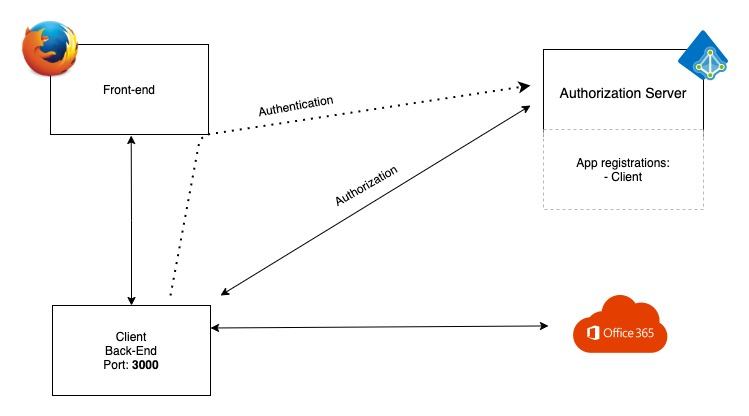

# The Scenario

The purpose of this part is to explain the basic CLIENT scenario we are using in the exercise.

## Architecture  (The Back-end For Front-end (BFF) pattern)

## Components

This scenario has 4 key components. 

* The Web browser (Used as the intermediate for the **oAuth2: Resource owner**)
  * The front-end part of the app
* The Client (**oAuth2: Client**)
  * Serving the Web front end
  * Hosting the back-end api
    * Login
    * Logout
    * Show Inbox
* Microsoft Entra ID (Trusted 3rd party. **oAuth2: Authorization Server**)
  * The Authorization Server
  * The Identity provider (Authorization Service)
* Office 365 (**oAuth2: Resource server**)
  * Serving, and protecting the InBox

