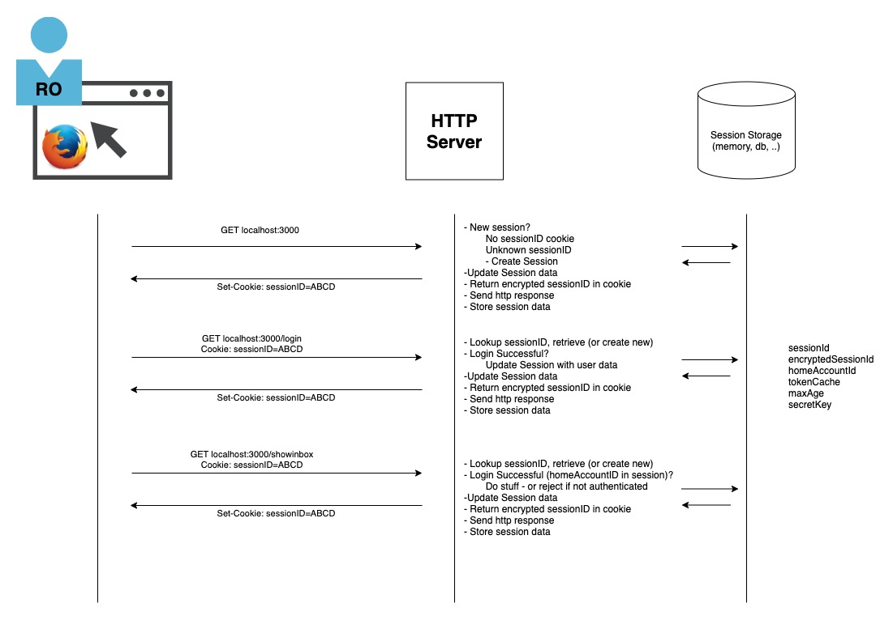
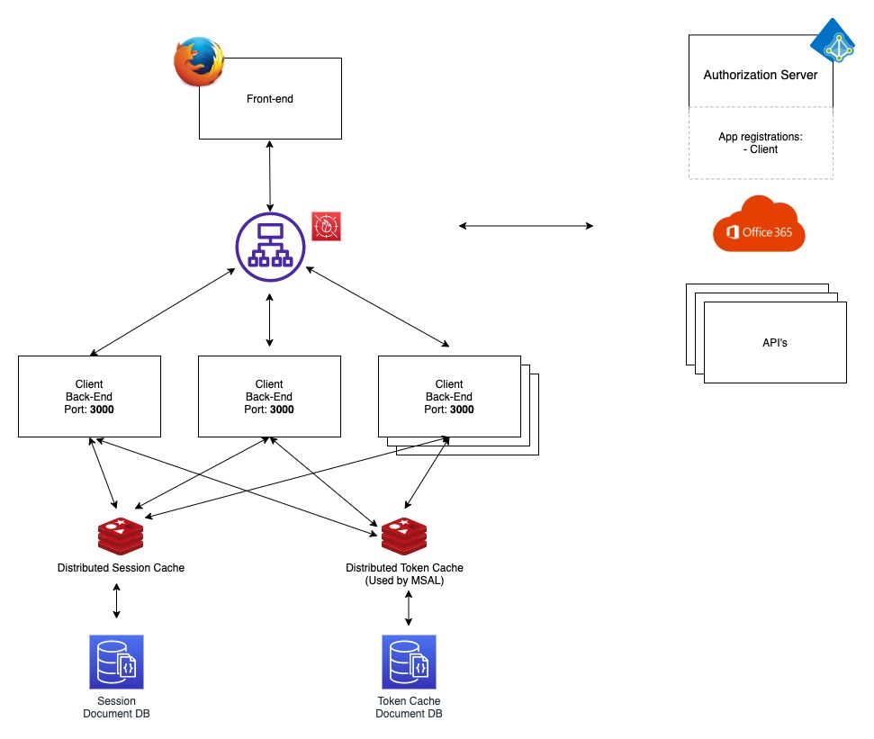

# Sessions & Token Cache Patterns

In This section we will explore and discuss patterns relates to sessions and token caching. They may be somewhat related.

## Sessions

Sessions are used to manage state. A session in our context is the pattern that we use to temporarily store information on the server for a series of events (requests & responses) between a browser and a server. A session can have multiple characteristic in many combinations:

* A session can start when a browser access an web server for the first time
* A session can start when a user logs-in to the server/application
* A session can end when a user logs-out of an application/server
* A session can end if the application/server decides to terminate it
* A session can persist between browser start/stop/restart
* A session can persist between server/application restarts
* Sessions are typically unique between one browser/client and an application/server. 

In our web application we use cookies to manage sessions. This is helpful in stateless protocols such as http.





## Token Caching

Our application/client needs access tokens to gain access to api's. For performance and usability we cache tokens. MSAL supports token caching. Different caching mechanisms are supported/recommended for different types of _oAuth2 clients_.

Our application used the NodeJS platform and MSAL. Other platforms will have somewhat similar support by MSAL, but it could differ. Other authentication and authorization frameworks may have support for token caching. Consult each framework for token caching features.

For _public clients_ like SPA, Native Applications, CLI -- the token cache should be persisted and encrypted. MSAL takes care of this for you by using the [MSAL Node Extensions](https://github.com/AzureAD/microsoft-authentication-library-for-js/blob/dev/extensions/msal-node-extensions/README.md)

For _confidential clients_, like web applications, we must *extend* MSALs tokens caching to use a "distributed token caching" pattern. We must also design and implement support for encryption

Additional MS resources:
* [Token Caching in MSAL Node](https://github.com/AzureAD/microsoft-authentication-library-for-js/blob/dev/lib/msal-node/docs/caching.md#performance-and-security)
* [MSAL Node Extensions](https://github.com/AzureAD/microsoft-authentication-library-for-js/blob/dev/extensions/msal-node-extensions/README.md)


## Scalability - Distributed sessions/token cache

Our application uses a typically web-application pattern, where we have a many-to-many relationship between the browser/client and the application/server. A user can be connected to our application from one or more browsers, which all is defined as unique sessions. The connection can be to one or more instances of the server/application.

In such a distributed scenario we need to make sure that all instances of "consumers" have access to the session storage. A typical production set-up will look like this:



As the scenario show, we have an additional distributed cache, the token cache - which also needs to be available for all client instances.

The need for distributed patters arise from the need to scale/performance. This is not unheard of in cloud-native patterns, quite often the norm.

## Options

What options do we have to mange session- and token cache storage. Could, or should, they be combined?

### 1 - Separate In memory storage at the client

Both the web servers's session store and MSAL's token cache store can use separate "in-memory" store. This is the default. Some challenges:
1. These stores often suffers from memory leakage - not for production.
2. They will not survive web server restart - information will be lost.
3. The default cache mechanism in MSAL does not partition on session - so the token cache for a user will be combined and available for all signed-in sessions for a specific user.
4. Scaling, different *instances* of the client will all have their own memory stores - user experience will be inconsistent and erratic.

### 2 - Cache - Persisting storage

Moving away from the in-memory store and either persist to disk/db will fix issue #1,#2 and to some extent prepare for a better solution of #4 from section #1.

Storing to disk/db could have some performance issues. This often solved with adding an in-memory cache like [Redis](https://redis.io/) which is supported by a db storage. 

````All patterns of persisting storage for sessions and token cache needs careful security considerations and threat modeling. Storage and transport must be encrypted!````

### 3 - Store MSAL token cache as part of session

For this alternative we use the session store to _persist_ the token cache. This will solve issue #3 from section #1.

This is quite often the preferred solution for web application. 

To code support for this pattern we typically have two options:
1. Use MSAL token cache framework and implement our own serialize/deserialize into the session using the iCachePlugin interface.
2. Manually serialize/deserialize the token cache into the session in our own events that get/use tokens,

Using the MSAL framework as far as possible would most likely be the better option (1) in the long run.

### 4 - Distribute session storage, Distributed token cache with segmentation.

This would be the full blown architecture shown in the drawing above.

1. Session: Session storage is persisted in a distributed memory cache (Redis) and supported by a database.
2. Token Cache is persisted in a distributed memory cache (Redis) and supported by a database. The MSAL token cache is extended to segment token cache on ```sessionID```.

This option will solve all issues in section #1 and is the most flexible, scalable and performant solution. **It's obviously also the most complex!**

As mentioned earlier - we transport and storage should be encrypted!