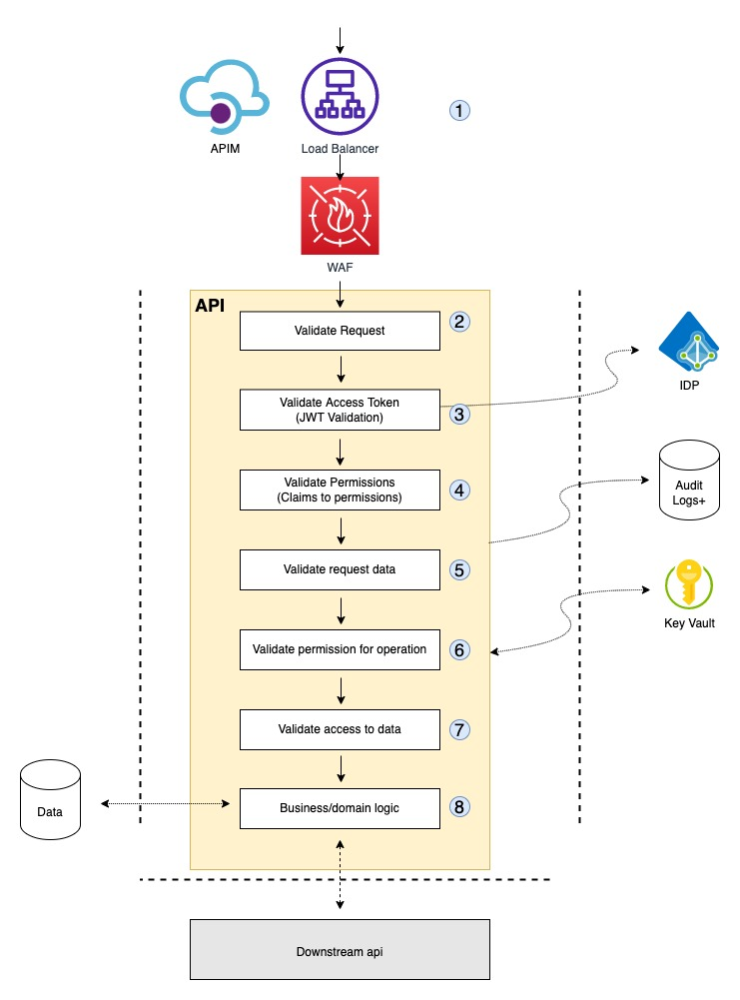

# Defence in Depth - Protecting APIs (🥸)

In this section we will have a general discussion of protecting/securing api's. APIs come in many shapes and forms. The level of protection, or the effort we put into secure our APIs, will have to relate to the data/systems we protect and the potential consequence of thing getting bad. 

## Why Security?

It's risk management for the business. It's an insurance model. We balance cost vs. risk of loss of time, money, privacy, reputation and business opportunity. Lack of security means lack of insurance.

Security i protecting against ill will, mistakes and accidents, theft, fraud, destruction, disruption - all captures by the CIA triad (Confidentiality, Integrity, Availability)

We never ever become *secure*! It is about finding the right level for our insurance

## Security in DevOps

In DevOps we view security in our SDLC from 3 perspectives:
1. Our development process (Dev)
2. Operations (Ops)
3. Our product (App, API)

All are equally important. A holistic and context aware view on people, process and technology is needed to find the right level of insurance at any moment in time. It's not static.

For the reminder of this discussion we will focus on #3, for an *typical* API.

## Securing an API

We use the illustration below for discussion purposes. Our strategy is to reject invalid calls to our API as fast as possible. This is a simple model - real world could be a lot more complex and less straight forward.

(Inspiration for the illustration+ from [https://omegapoint.se/defence-in-depth](https://omegapoint.se/defence-in-depth))

Some steps to protect the flow of information could be:

1. Our API's should be protected by sufficient **infrastructure**. This could be load balancers, Web Application Firewalls (WAF), reverse proxies and API Management Solutions (APIM).

2. **Validating the request**. We should use a web server that will validate that the HTTP request is valid, looking at format, size etc. (Example: validate size, header, rfc conformity.)

3. **Validate the access token**. This will typically be validating a JWT token. We need to interact with the IDP (keys) to validate signature. We would also typically validate audience, validate with respect to time (iat,nbf,iat), issuer and other relevant meta parameters. (Example: Look at [rfc7519 - JSON Web Token Best Practices](https://datatracker.ietf.org/doc/html/rfc8725))

4. **Validate permission**. Permissions in a token would typically come as claims in the token. These claims should be transferred into the *permission model* used by the applications and the domain logic later on. (Example: Convert *scp* and *roles* claims into domain specific permission model)

5. **Validate request data**. This would typically be an early validation of the request, often against a schema defining how specific requests should look, format of various fields etc. (Example: have a scheme validation of parameters like id, title etc., general input validation)

6. **Validate permissions for operation**. In this step we would validate that the user/client have access to the operations (the HTTP verbs) before we start requesting data and thus put load on our system. (Example: Does the user/client have access to PUT - if not reject before requesting any more data)

7. **Validate access to data**. In this step we validate that the user/client should have access to the data that's requested. (Example: a user should only have access to own data, not all data.)

8. **Business / domain logic**. In this step we assume the request is valid in form, for operation and for data and leave the rest to the business logic (controller, model) for the next steps. 

There are other security measures in the API implementation that we don't discuss here. This would typically be rate limiting, session and token cache management, etc.

## Good practices

* Use *keyvaults* for secret management
* Introduce *proper* error handling - failing safely.
* Do audit and error logging.
  * Send logs to a protected sone/system *outside* the api. 
  * Have routines for detection and incident handling
* Use secure default in all steps
* Document APIs using Swagger or OpenAPI spec
* Create security related test
  * Use [OWASP ASVS](https://owasp.org/www-project-application-security-verification-standard/) as an guide line for testing and secure coding practices.
  * Apply tools to test your API's. (Fuzzers, ZAP etc..)
  * Test from the outside (integration, end-to-end) (utilizing all components?)
* Consult OWASP Top 10's
  * [API](https://owasp.org/www-project-api-security/)
  * [WEB](https://owasp.org/Top10/)

## Good Resources

* [Secure By Design](https://www.manning.com/books/secure-by-design) by Johnsson, Deogun and Sawano.
  
   

* [The OWASP Security Project](https://owasp.org/www-project-api-security/)
* [The OWASP Cheat Sheet Series](https://owasp.org/www-project-cheat-sheets/)
* [The Equinor API Strategy](https://github.com/equinor/api-strategy).   Use and contribute!
* [Security Cheat Sheets from Philippe De Ryck](https://pragmaticwebsecurity.com/cheatsheets.html)
