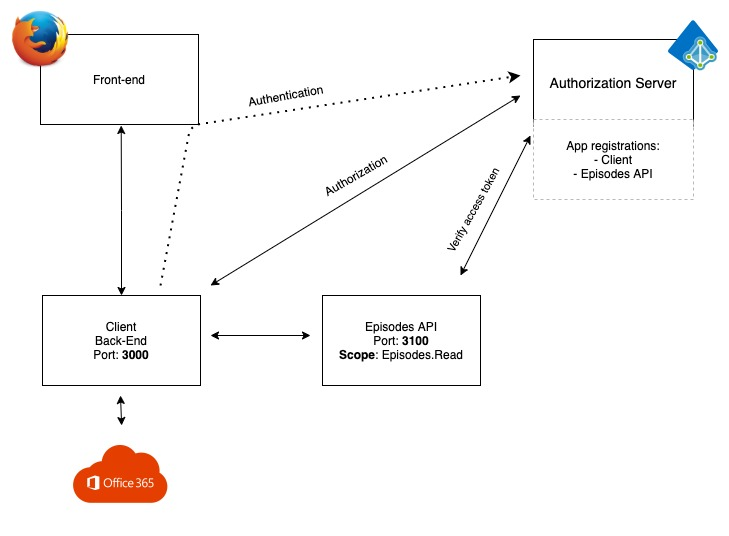

# The Scenario

The purpose of this part is to explain the API scenario we are using in the exercise.

## Architecture

## Components

This scenario has 2+1 key components. The 2 key components are independent of each-other and can be seen as microservices.

* The Client
  * Serving the Web front end
  * Handling login/logout, sessions and token cache.
  * Managing requests for authentication and authorization - getting tokens from Microsoft Entra ID
  * Requesting users InBox from the O365 API
  * Requesting a list of GOT Episodes from the Episodes API
* The Episodes API
  * The protected resource server
  * Serve a JSON document with GOT Episodes at /api/episodes
  * Requests needs to be validated, tokens needs to be issued by Microsoft Entra ID
* Microsoft Entra ID
  * The identity provider and the Authority Server

Steps:

## The flow

The general use case flow is as follow:

* The user log in to the web application
* The user selects "Show GOT Episodes"
* An Access token for the Episodes API is acquired
* The client requests a list of episodes from the API
* The API receives and validates the request
* Depending on the validation, the API returns either a list of episodes or an error message
