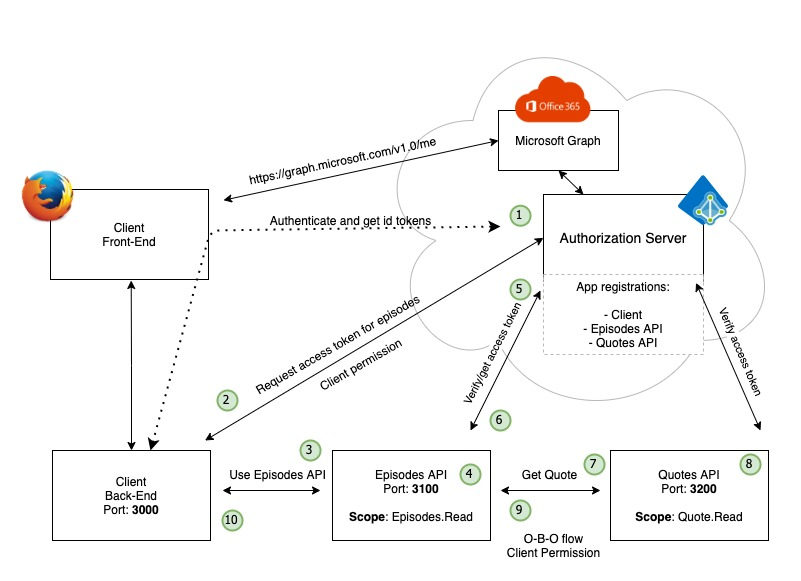

# The On-Behalf-Of (OBO) flow

## Context

* The On-Behalf-of flow is an OAuth2 Protocol Extension based on [rfc8693 - OAuth2 token exchange](https://datatracker.ietf.org/doc/rfc8693/)

  > This specification defines a protocol for an HTTP- and JSON-based
   Security Token Service (STS) by defining how to request and obtain
   security tokens from OAuth 2.0 authorization servers, including
   security tokens employing impersonation and delegation
* [Microsoft Identity Platform OAuth2 OBO](https://docs.microsoft.com/en-us/azure/active-directory/develop/v2-oauth2-on-behalf-of-flow)
* Supported by Microsoft Entra ID (MS Identity Platform) on V1 and V2 endpoints. Not supported for Microsoft Entra ID B2C
* May not be supported by other Security Token Services (STS) - none Microsoft Entra ID
* Framework support will vary

## The Flow

### The request

* The middle-tier access token request (5)
* Request endpoint https://login.microsoftonline.com//oauth2/v2.0/token 

  | parameter | value |
  | --- | --- | 
  | grant_type | urn:ietf:params:oauth:grant-type:jwt-bearer |
  | client_id | Id of the client making the request (Episodes Api) |
  | client_secret | The client (Episodes Api) secret |
  | assertion | The access token that the Episodes Api got from the Client in step 3. Audience in claim must be client_id of Episodes Api |
  | scope | The scope that is requested (The scope in Quotes Api) |
  | requested_token_use | on_behalf_of |

### The response

* The middle-tier access token request response (6) 
* Response values 
  | parameter | value |
  | --- | --- | 
  | token_type | Bearer |
  | scope | The requested scope (exposed by Quotes Api) |
  | expires_in | Number of seconds until the access token expire |
  | access_token | The actual access token that will be used by the Episodes Api when requesting from the Quote Api (step 7) 

## The Application Objects in Microsoft Entra ID

* All objects that we want to protect must be registered in Microsoft Entra ID
* The Client:  Must have a client_id and client_secret (depending on which flows that are used). No changes compared to previous exercises 
* The Episodes Api: Must have a client_id and a client_secret. Must expose scope for api - Episodes.Read. Compared to previous exercises - we need a client_secret to be able to request a token on-behalf-of 
* The Quote Api: Must have a client_id. Must expose scope for api - Quote.Read. Compared to previous exercises - this is a new registration
