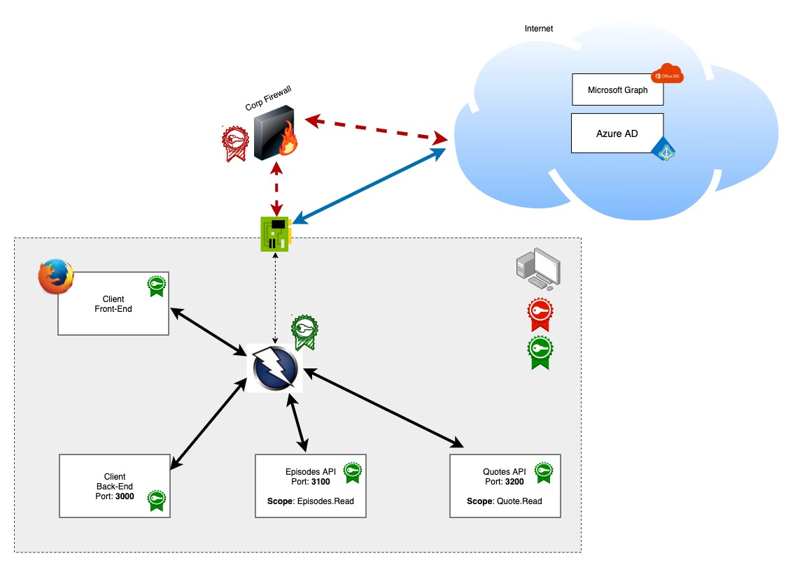
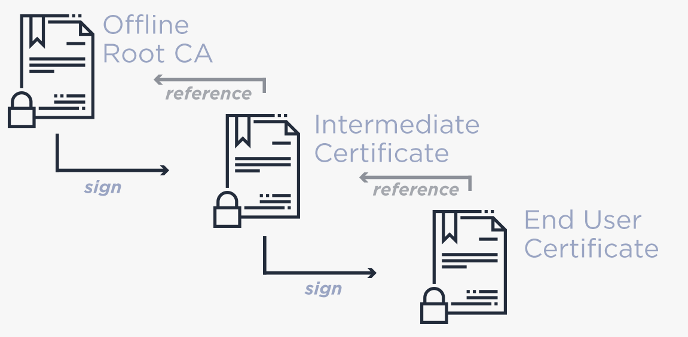

# Inspection of network traffic

When we develop our application we usually have good tools for ordinary debugging and investigation. These tools are an important part of the developer toolbox, especially in the interconnected world where our apps talk to other apps/api frequently. However, what happens when we communicate over the network is more of a black box. This is even more the case when we use frameworks, which may do things differently to what we expect and what the specifications are describing.

Network traffic can be investigate on many levels. One option is to use low level tools such as [WireShark](https://www.wireshark.org/) and analyze network traffic on a packet level. Another option is to use tool operating higher up the stack, such as http/https proxies. We are going to use the latter one.

[OWASP Zap](https://www.zaproxy.org/) has many use cases, from debugging to scanning and to security testing. There are several good alternatives to OWASP Zap, but we choose this tool because it is open source all the way!

## Proxies - Man In The Middle

Proxies operate as a **man-in-the middle** for all relevant network traffic. This of course a dream scenario for any hacker - so we need to use tool and patterns with caution!

### The Scenario

The diagram shows how the proxy operates. It can be placed in the middle of network traffic on your computer. If your are on a corp network it may use an outgoing proxy for network traffic. This is called an up-stream-proxy. If your are connected to a corp network (directly or using VPN) your computer is already configured to use the corp firewall/proxy. (Most networks in Equinor does not use a separate proxy, they are de-proxified)

### The the Browser

The browser (user agent) can be configured to send all network traffic through the Zap proxy.

### From the back-end

The various components in our scenario (browser, client back-end episodes api, quotes api) can be configured to send traffic through the Zap proxy independently of each other. In this set-up we are only able to inspect network traffic until it leaves our local computer.

## HTTP / HTTPS - CA and Certs

Sending unencrypted traffic using HTTP through a proxy for inspection is usually straight forward. Sending encrypted traffic using HTTP is quite another ball game. 

### Conceptual view

In order for the encryption to work there needs to be a chain of trust. This chain involves certificates which is created/signed by Certificate Authorities (CA). On your computer and in your browsers the is a store of root certificates issues by valid CA's. When using HTTPS/SSL these are key elements of verifying the chain of trust (all other certificates issued using HTTPS/SSL needs to be based on a valid root certificate to be considered **valid**)

The Chain of trust

### Generating certificates

All this means that for a connection to be valid, HTTPS/SSL certificates should be based on valid root CA's or a connected intermediate certificate. Valid in this context of course assumes that the software components involved in the network traffic validates the certificates :)

So then we have basically two options;

1. Turn off certificate validation - accept invalid certificates This could be an option in some cases - but will usually give you problems since not all components supports this approach. On a principal level you would like to keep the validation turned-on in the components.

2. Create valid certificates This is the approach we will use, we dynamically create certificates for our purpose (or OWASP Zap does). To make this work we will have to create our own CA (Certificate Authority) cert and add this to the trust store in our environment (computer, browser, application)

As a side note, if you have an Equinor Managed computer, Equinor's self generated CA cert's for the internal network are already added to the cert store on your computer. If it had not, https communication would not be able to pass the corporate proxy/firewall.

## --Now You--

* Find the certificate store on your computer and on your browser
* Browse to [https://www.equinor.com](https://www.equinor.com)
  * Inspect the HTTPS certificate and the trust chain
  * Find the root CA in your browser's cert store

## Security considerations

* Use self generated CA and keys with caution.
* Remember to clean-up (remove from certs stores)
* Rotate self generated CA's often
* Be careful of using the "--ignore" SSL validation switch of components
  