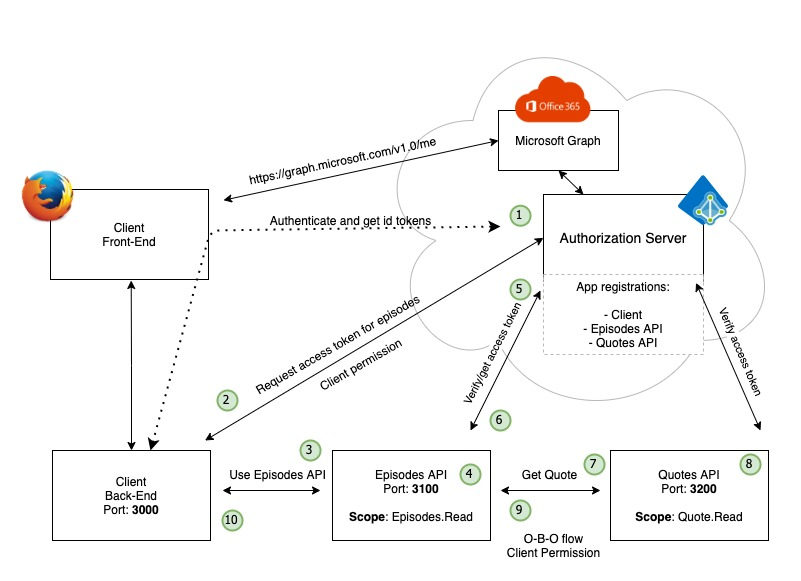

# Integration testing

In this section we will explore challenges around integration testing.

## The scenario

In our scenario, integration testing could involve the following steps:

* Starting up the component(s) (client, episodes or quotes)
  * We could dockerize and use containers
* Testing the component from the outside using code. The code could test from the browser or directly towards the component APIs.

So far so good. The various components would give a different set of challenges

### The Client

The client consist of two component, the web frontend and the backend. Our system is using a backend for frontend pattern. This is often seen as a "more secure" design pattern - where tokens are managed at a confidential client rather than in a public client. We currently have a few challenges for a fully automated test regime:

* In order to test the client we need to authenticate (and the app should not know it's under test)
  * Automatic authentication will not work with users having MFA on their account
  * We need to use the browser (user agent) when authenticating
    * For the OAuth2 code grant flow
    * For having a sessionId which the backend uses for authorization
  * Tokens are stored in the backend, not available on the outside
  * We use AzureAD as the Identity Provider (a key component, a component that we do not control)
* Other challenges?

This represents a challenge on many levels. Some solutions (some more dirty than others) could be:

* Use a [OAuth2 Mock Server](https://github.com/navikt/mock-oauth2-server)
  * This could work but it will need a lot of adaptions since we are using MSAL for NodeJs. MSAL is supporting the standard, but the framework adds a lot of other stuff that would have to be implemented and maintained in the Mock server.
  * Moving away from MSAL NodeJs could make this a valid option. There may be ways to configure MSAL to ignore the MS specific stuff - but's that's not obvious in any documentation.
* Get a token from the outside and inject it to the token cache?
  * Sounds dirty but doable until we hit MSAL again. There is so much MSAL-specific happening in the framework with communicating to Azure AD which will bring problems, like SSO. MSAL will also check that the tokens was issued using the correct flow, so throwing tokens around would most likely give problems.
  * We will still have to fake the session store as well and connect this to the token cache. Again - it's not scalable, it's do-able but not really a good idea after all.
  * We would still have to use browser, or at least let our test code handle the "sessionID" cookie required by the back-end
* Turn off authentication?
  * Could be done, but we would break most principles and we would really like to have it turned on.
* Use a different flow to do the initial login/authentication?
  * We would have to introduce code into our app that was used when in "test".
    * We could use a dependency injection pattern or similar to do this.
  * We would still have challenges with accounts with MFA (which is most accounts)
* We could do the first login step manually - and the let the tests take over. This would provide a solution, but would not be fully automatic and able to put into a CI pipeline.
* Use a test tool that allows for visiting multiple domains/origins and that would follow redirects
  * More testing of code, but that could be ok.
  * We would still have the challenge and MFA

If we can solve the challenges related to authentication and authorization, perhaps breaking a few principles, we are getting a lot of options for how to test. It's down to this questions:

> Where the best way to spend out test "money"? And don't forget that all automation is code - code that need TLC as long as it's there!

For the continuance of this exercise we make the following choices:

* We use Azure AD, but we do not want to test using the Official Azure AD, it's production
* We use [Office 365 developer program](https://developer.microsoft.com/en-us/microsoft-365/dev-program) to get access to a  separate Azure test environment
* We create test users without MFA to enable automated tests
* We let our code know that's its under test
  * If in test, use a different flow (ROPC) to login and get the initial tokens.
  * An option could be to use a test tool that supported redirects and multiple origins.
* We use Docker and docker-compose to build and serve the infrastructure
* We drive the test from the perspective of the end-user (acceptance) and use [Cypress](https://www.cypress.io/) for this.
* The acceptance tests should be fully automated and be able to run in a pipeline.
